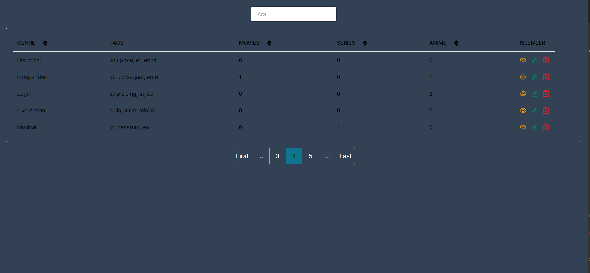
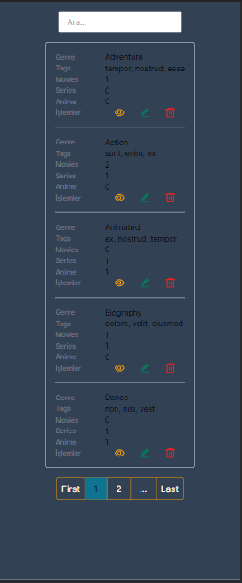

## Getting Started

First, run the development server:

```bash
npm run dev
# or
yarn dev
# or
pnpm dev
```

Open [http://localhost:3001](http://localhost:3001) with your browser to see the result.


## Image of the project

